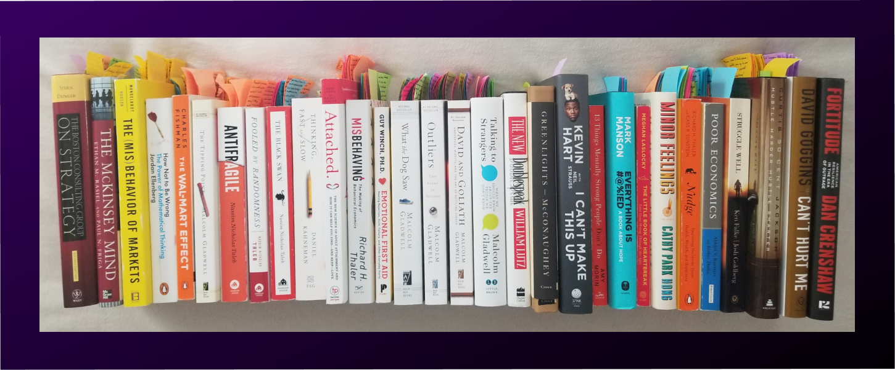

# Quarantine Readings
---

## Background

As the pandemic allowed me to leverage social distancing to increase my focus and learn new things in isolation, I wanted to share some of my favorite books I read in 2020. I selected these books to learn about the business world, emotional intelligence, and the psychology of human actions and inactions. It started as a casual read of a few self-development books such as "13 Things Mentally Strong People Don't Do" and "Hustle Harder, Hustle Smarter." Then, it developed into a deep dive into the literature of psychology, social science, behavioral science, behavioral economics, probability theories, and financial mathematics.

The lack of a summer internship in 2020 left me with the desire to learn the technical skills applicable to my future employment and relevant to the topics I was reading at the time. Luckily, I stumbled onto UC Berkeley Extension's FinTech Bootcamp after browsing for probabilities, predictive analytics, and financial technology. I entered my contact information to download their curriculum. In two hours, I received a call from the admin at UC Berkeley Extension, and in five days, I enrolled to attend the Bootcamp. 

The Bootcamp taught me Python programming language, SQL, financial modeling, data wrangling, engineering and visualization, machine learning, and blockchain technologies, many of which are helpful for employment nowadays. I also secured a couple of employment opportunities using these skills on top of my university education. These events happened because I picked up the first two books I mentioned above from a local Target store. So, without further ado, I listed the 30 books I completed during the quarantine, without any particular order, embedded in hyperlinks to Amazon.com as follows:

| 30 Completed Books during Quarantine |
| ------------------------------------ |
|  |

#### The Complete List

1. [The McKinsey Mind](https://www.amazon.com/McKinsey-Mind-Understanding-Implementing-Problem-Solving/dp/0071374299/ref=sr_1_2?dchild=1&keywords=The+Mckinsey+mind&qid=1614673537&sr=8-2)
2. [Boston Consulting Group on Strategy 2nd Edition](https://www.amazon.com/Boston-Consulting-Group-Strategy-Perspectives/dp/0471757225/ref=tmm_hrd_swatch_0?_encoding=UTF8&qid=1614673577&sr=8-5)
3. [Fooled by Randomness](https://www.amazon.com/Fooled-Randomness-Hidden-Markets-Incerto/dp/1400067936/ref=tmm_hrd_swatch_0?_encoding=UTF8&qid=1614673608&sr=8-1)
4. [The Black Swan](https://www.amazon.com/Black-Swan-Improbable-Robustness-Fragility/dp/081297381X/ref=sr_1_1?dchild=1&keywords=The+Black+Swan&qid=1614673651&sr=8-1)
5. [Antifragile](https://www.amazon.com/Antifragile-Things-That-Disorder-Incerto/dp/0812979680/ref=sr_1_1?crid=KYP297IBL8P2&dchild=1&keywords=antifragile&qid=1614673680&sprefix=Anti%2Caps%2C255&sr=8-1)
6. [The Tipping Point](https://www.amazon.com/Tipping-Point-Little-Things-Difference/dp/0316316962/ref=tmm_hrd_swatch_0?_encoding=UTF8&qid=1614673783&sr=8-1)
7. [The Wal-Mart Effect](https://www.amazon.com/Wal-Mart-Effect-Powerful-Works-Transforming/dp/0143038788/ref=sr_1_1?crid=D34K0JLC298R&dchild=1&keywords=the+wal-mart+effect&qid=1614673833&sprefix=The+wal-mart+efect%2Caps%2C229&sr=8-1)
8. [How Not to Be Wrong: The Power of Mathematical Thinking](https://www.amazon.com/How-Not-Be-Wrong-Mathematical/dp/1594205221/ref=tmm_hrd_swatch_0?_encoding=UTF8&qid=1614673880&sr=8-1)
9. [The Misbehavior of Markets: A Fractal View of Financial Turbulence](https://www.amazon.com/The-Misbehavior-of-Markets-audiobook/dp/B07PCSM62Z/ref=sr_1_1?crid=GILI4YZAJI9G&dchild=1&keywords=misbehavior+of+markets&qid=1614673941&sprefix=misbehavior+of+ma%2Caps%2C233&sr=8-1)
10. [Thinking Fast and Slow](https://www.amazon.com/Thinking-Fast-Slow-Daniel-Kahneman/dp/0374275637/ref=tmm_hrd_swatch_0?_encoding=UTF8&qid=1614674003&sr=1-2)
11. [Nudge: Improving Decisions about Health, Wealth and Happiness](https://www.amazon.com/Nudge-Improving-Decisions-Health-Happiness/dp/014311526X/ref=sr_1_3?crid=2SMNMZXMGBDZN&dchild=1&keywords=nudge+improving+decisions+about+health%2C+wealth%2C+and+happiness&qid=1614674070&s=books&sprefix=Nudge%2Cstripbooks%2C225&sr=1-3)
12. [Poor Economics](https://www.amazon.com/Poor-Economics-Radical-Rethinking-Poverty/dp/1610390938/ref=sr_1_1?crid=1V58MF7VN2TO0&dchild=1&keywords=poor+economics&qid=1614673185&sprefix=poor+econo%2Caps%2C275&sr=8-1)
13. [The New Double Speak](https://www.amazon.com/New-Doublespeak-Anyones-Saying-Anymore/dp/0060171340/ref=sr_1_1?dchild=1&keywords=The+new+double+speak&qid=1614674335&s=books&sr=1-1)
14. [Talking to Strangers](https://www.amazon.com/Talking-Strangers-Should-about-People/dp/0316478520/ref=tmm_hrd_swatch_0?_encoding=UTF8&qid=1614674126&sr=1-2)
15. [David and Goliath](https://www.amazon.com/David-Goliath-Underdogs-Misfits-Battling/dp/0316204366/ref=tmm_hrd_swatch_0?_encoding=UTF8&qid=1614674157&sr=1-1)
16. [Outliers](https://www.amazon.com/Outliers-Story-Success-Malcolm-Gladwell/dp/0316017922/ref=tmm_hrd_swatch_0?_encoding=UTF8&qid=1614674183&sr=1-1)
17. [What the Dog Saw](https://www.amazon.com/What-Dog-Saw-Other-Adventures/dp/0316075841/ref=tmm_hrd_swatch_0?_encoding=UTF8&qid=1614674207&sr=1-1)
18. [Emotional First Aid](https://www.amazon.com/Emotional-First-Aid-Rejection-Everyday/dp/0142181072/ref=sr_1_1?crid=1J2IQV0PXQZFQ&dchild=1&keywords=emotional+first+aid&qid=1614674098&s=books&sprefix=Emotional+first+aid%2Cstripbooks%2C226&sr=1-1)
19. [Misbehaving](https://www.amazon.com/Misbehaving-Behavioral-Economics-Richard-Thaler/dp/0393080943/ref=tmm_hrd_swatch_0?_encoding=UTF8&qid=1614674484&sr=8-1)
20. [Attached](https://www.amazon.com/Attached-Science-Adult-Attachment-YouFind/dp/1585429139/ref=sr_1_1?dchild=1&keywords=Attached&qid=1614674422&sr=8-1)
21. [Struggle Well](https://www.amazon.com/Struggle-Well-Thriving-Aftermath-Trauma/dp/1544510373/ref=sr_1_1?crid=3SFIB30RBE29J&dchild=1&keywords=struggle+well&qid=1614674449&sprefix=Struggle+well%2Caps%2C223&sr=8-1)
22. [Hustle Harder, Hustle Smarter](https://www.amazon.com/Hustle-Harder-Smarter-Curtis-Jackson/dp/006295380X/ref=tmm_hrd_swatch_0?_encoding=UTF8&qid=1627498887&sr=8-3)
23. [Can't Hurt Me](https://www.amazon.com/Cant-Hurt-Me-Master-Clean/dp/1544507852/ref=sr_1_1?crid=1C6Q3N5E7NC9P&dchild=1&keywords=can%27t+hurt+me&qid=1614674605&sprefix=Can%27t+Hurt+me%2Caps%2C250&sr=8-1)
24. [Fortitude](https://www.amazon.com/Fortitude-American-Resilience-Era-Outrage/dp/B085LQ43LJ/ref=sr_1_1?crid=3HIAERS5F6H5Y&dchild=1&keywords=fortitude+dan+crenshaw&qid=1614674627&sprefix=fortitude%2Caps%2C236&sr=8-1)
25. [Greenlights](https://www.amazon.com/Greenlights-Matthew-McConaughey/dp/0593139135/ref=tmm_hrd_swatch_0?_encoding=UTF8&qid=1614674652&sr=1-1)
26. [I Can't Make This Up](https://www.amazon.com/Cant-Make-This-Up-Lessons/dp/1501155563/ref=tmm_hrd_swatch_0?_encoding=UTF8&qid=1627498627&sr=8-2)
27. [13 Things Mentally Strong People Don't Do](https://www.amazon.com/Things-Mentally-Strong-People-Dont/dp/0062358294/ref=tmm_hrd_swatch_0?_encoding=UTF8&qid=1627498587&sr=8-2)
28. [Everything is F**ked: A Book About Hope](https://www.amazon.com/Untitled-Mark-Manson/dp/0062888439/ref=sr_1_1?dchild=1&keywords=everything+is+fucked&qid=1627498497&sr=8-1)
29. [The Little Book of Heartbreak](https://www.amazon.com/Little-Book-Heartbreak-Wrong-Through/dp/0452298326/ref=sr_1_1?dchild=1&keywords=A+Little+book+of+heartbreak&qid=1614674382&sr=8-1)
30. [Minor Feelings: An Asian American Reckoning](https://www.amazon.com/Minor-Feelings-Asian-American-Reckoning/dp/1984820389/ref=sr_1_1?crid=11ETURKHJ2TGI&dchild=1&keywords=minor+feelings+cathy+park+hong&qid=1627498782&sprefix=Minor+Feelings%2Caps%2C277&sr=8-1)

---
### Written By

__Dana K Lain__, Profile: [LinkedIn](https://linkedin.com/in/dana-kyine-lain)
